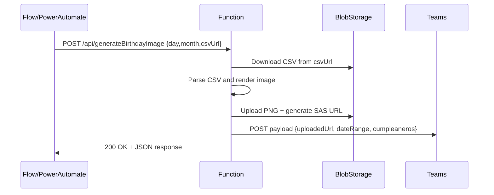

# 🎂 Azure Function – Birthday Image Generator

## 📖 Overview
This Azure Function generates a **weekly birthday image** for employees based on data from a CSV file and employee photos stored in Azure Blob Storage.  
The generated image is uploaded to Azure Storage, and its URL is optionally sent to a Microsoft Teams channel via webhook.

---

## 🧭 Flow Summary

### 1. Trigger
Triggered by an **HTTP POST** request to:
```
/api/generateBirthdayImage
```
- **GET requests** or **health probes** are ignored (return `200 OK`).

### 2. Input
Accepted via request body or query parameters.

#### Supported JSON body:
```json
{
  "day": 19,
  "month": 7,
  "csvUrl": "https://<storage>/data/cumples.csv?<sas>"
}
```

| Field | Type | Description |
|-------|------|-------------|
| `day`, `month` | number | Optional. Base date for the week. Defaults to current date if not provided. |
| `csvUrl` | string | Optional. URL to a CSV file (recommended). |
| `csvText` | string | Optional. CSV content inline as text. |
| `photosBaseUrl` | string | Optional. Override default photo base URL. |

---

### 3. CSV Content
The CSV must contain:
```
FirstName,LastName,Day,Month,PhotoName
```

Example:
```csv
FirstName,LastName,Day,Month,PhotoName
Ana,Lopez,12,9,AnaLopez.png
Jose,Rubio,24,10,JoseRubio.png
```

---

### 4. Photo Source
Each `PhotoName` is resolved as follows:
1. If it’s an absolute URL → used as-is.  
2. Else → `PHOTOS_BASE_URL` + `PhotoName`.  
3. If missing or not found → fallback to `user.png`.

> 💡 `PHOTOS_BASE_URL` usually points to a Blob container with **read-only SAS** or public access, e.g.  
> `https://stcumplesmx001.blob.core.windows.net/fotos-empleados?<sas>`

---

### 5. Image Rendering
- Uses [`@napi-rs/canvas`](https://www.npmjs.com/package/@napi-rs/canvas) to generate a **1366x768** PNG.
- Assets:
  - Background: `assets/images/background.png`
  - Day bubble: `assets/images/day-bubble.png`
  - Fonts: `assets/fonts/Inter-Regular.ttf`, `Inter-Bold.ttf`
- Draws:
  - Date range for the week (e.g., *July 19 – July 25*)
  - Employee photos with names and birthday days.

Output file path:
```
/tmp/birthday-week-YYMMDDHHmmss.png
```

---

### 6. Upload to Azure Blob Storage
After rendering, the image is uploaded to the configured Blob container.

- Container: from `BIRTHDAY_CONTAINER`
- File name: `birthday-week-YYMMDDHHmmss.png`
- SAS link generated with expiration (default **14 days**).

Returned URL format:
```
https://<account>.blob.core.windows.net/<container>/<file>?<sas>
```

---

### 7. Teams Notification (Optional)
If `TEAMS_WEBHOOK_URL` is defined, the Function sends a POST payload:
```json
{
  "uploadedUrl": "https://...png?<sas>",
  "cumpleaneros": 8,
  "dateRange": { "start": "2025-07-19", "end": "2025-07-25" }
}
```
This payload can trigger:
- A Power Automate Flow (trigger: “When a Teams webhook request is received”), or  
- Direct webhook message to a Teams channel.

---

### 8. Response
Example output:
```json
{
  "message": "Image generated successfully",
  "dateRange": {
    "start": "2025-07-19",
    "end": "2025-07-25"
  },
  "cumpleaneros": 8,
  "uploadedUrl": "https://stcumplesmx001.blob.core.windows.net/birthday-images/birthday-week-250719143500.png?<sas>",
  "source": "csvUrl"
}
```

---

## ⚙️ Configuration (App Settings)

| Name | Description |
|------|--------------|
| `PHOTOS_BASE_URL` | Base URL (or SAS) for the photo storage. |
| `AZURE_STORAGE_ACCOUNT_NAME` | Storage account name. |
| `AZURE_STORAGE_ACCOUNT_KEY` | Storage account key. |
| `BIRTHDAY_CONTAINER` | Blob container name for generated images. |
| `BIRTHDAY_SAS_TTL_HOURS` | SAS expiration in hours (default 336 = 14 days). |
| `TEAMS_WEBHOOK_URL` | Teams webhook for posting notifications (optional). |

---

## 🧩 Other Endpoints
| Endpoint | Method | Purpose |
|-----------|---------|---------|
| `/api/testCanvas` | GET | Lightweight check that canvas works in Azure environment. |

> Avoid running `/api/generateBirthdayImage` in health probes; it will generate images and consume resources.

---

## 🧼 Maintenance
### Lifecycle Management
Configure automatic cleanup in Azure Storage:
- Delete blobs **older than 60 days** in your container (`birthday-images`).
- Portal path:  
  `Storage Account → Data Management → Lifecycle Management → + Add rule`

---

## 🔐 Security
- Keep all secrets (keys, SAS, webhook URLs) in **Application Settings** or **Azure Key Vault**.  
- For production:  
  - Use `authLevel: function` (require Function Key).  
  - Rotate storage keys periodically.  
  - Restrict container SAS permissions to **read (r)** only.

---

## 🪄 Optional Enhancements
- **Timer Trigger**: run automatically every Monday at 9 AM.  
- **Adaptive Card in Teams**: show image inline with week label.  
- **Managed Identity**: replace account key for uploads (internal use).  
- **Alerting**: set Application Insights alerts for errors or long durations.

---

## 🧩 Example Weekly Flow



---

## 👥 Credits
Developed and maintained as part of the **Endava Birthday Image Automation** initiative.  
- Project Manager: **Selene Jonguitud**
- Developer: **Allen Fernando García García**
- Stack: **Azure Functions (Node.js)** + **Azure Blob Storage** + **Microsoft Teams Webhook/Power Automate**.


